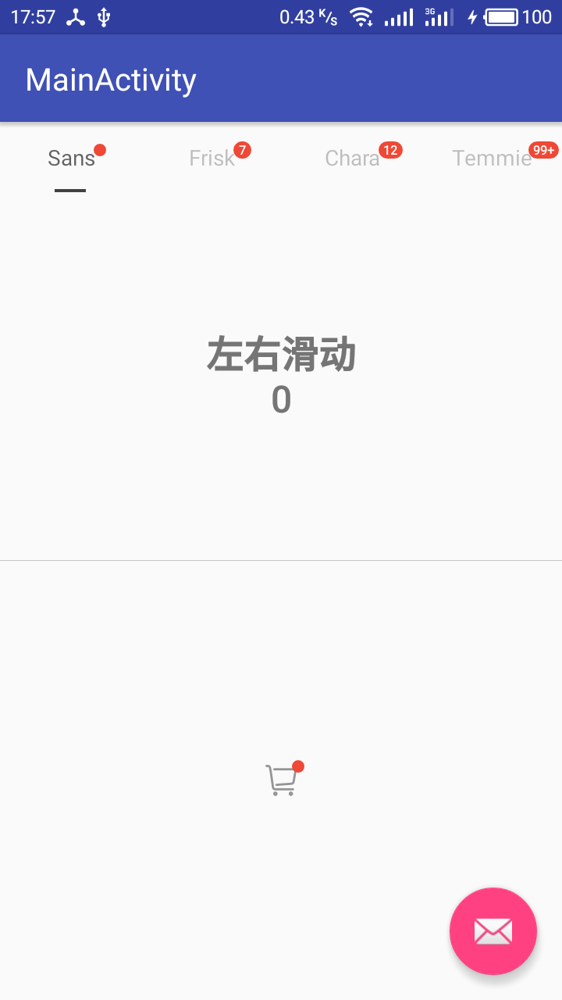
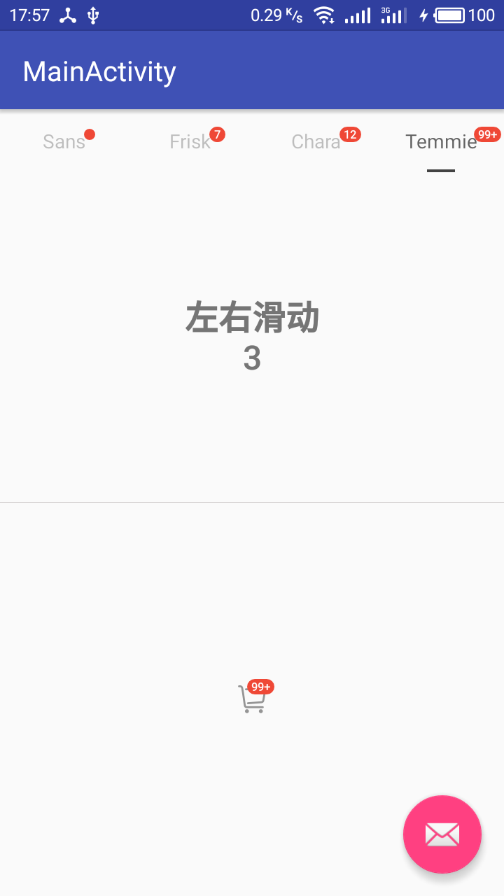

[  ](https://bintray.com/unicolas/maven/trollbadgeview/_latestVersion)
[](https://www.apache.org/licenses/LICENSE-2.0)


ThrollBadgeView是一个自定义的角标View,支持依附于文字和图片, 同时自带了修改过的design包下的Tablayout与ViewPager,前者可以自定义指示器宽度,后者将其改为缓冲0页
去除了android.design包的依赖

### 依赖

Android Studio 

> compile 'im.unicolas:trollbadgeview:1.1'

ADT

> 不存在的  :P


### 效果

</img>
</img>

### 使用方法

- 属性

```
LabelView.LABEL_MODE_TEXT   依附模式为文字   (default
LabelView.LABEL_MODE_IMG    依附模式为图片
```

- 通用方法

```
//设置角标依附模式  default : LabelView.LABEL_MODE_TEXT
labelView.setLabelMode(LabelView.LABEL_MODE_TEXT);
//设置角标是否显示
labelView.setLabelViewVisiable(true);
//设置角标内字符  设置为null 为只显示小红点不显示内字符
labelView.setLabelNum("99+");
//设置角标的背景颜色   default : 0xffef4836
labelView.setLabelBg(0xffef4836);
//返回角标是否显示  default : false
boolean labelViewVisiable = labelView.isLabelViewVisiable();
//返回角标内的字符
String labelNum = labelView.getLabelNum();
//返回角标依附的文字
String word = labelView.getWord();
```

- 依附文字(示例为在TabLayout中依附文字)

```
//设置依附的文字
labelView.setWordShow("Sans");
//设置依附的文字大小  default : 14  (单位sp)
labelView.setWordSize(14);
//设置依附的文字颜色  default : 0xffbdbdbd
labelView.setWordColor(0xffbdbdbd);
```

- 依附图片

```
//设置依附模式为图片
labelView.setLabelMode(LabelView.LABEL_MODE_IMG);
//设置图片 可选直接传入Bitmap|resources|localFile
//labelView.setBitmap4Icon(bitmap);
labelView.setBitmap4Icon(R.mipmap.test_cart);
//labelView.setBitmap4Icon(Environment.getExternalStorageDirectory().getAbsolutePath() + "/test.jpg");
```

## END
